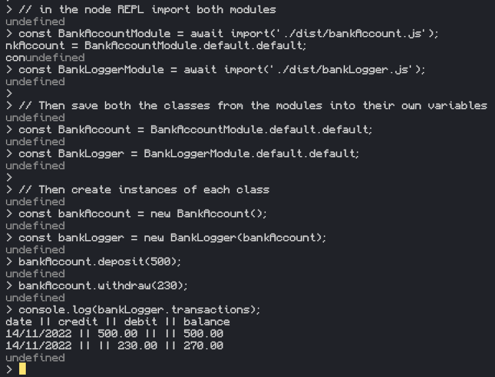

# Instructions for installation and running the app
## Installing everything
1. Clone/Fork repository.
2. Run NPM install in the root of the repository.
3. Run npx tsc command to ensure you have the latest distribution files.
note: Typescript was added as a dev dependency to the project.

```javascript
git clone <repository-address>
npm install
npx tsc
```
## Running the App

1. Open the NODE REPL.
2. Import both modules to the REPL. (From dist, as you are unable to import the raw TS files.)
3. Extract both classes from the modules.
4. Create BankAccount class.
5. Create BankLogger class with BankAccount in its constructor.

```shell
node
```

- Copy and paste the entire code block below and then press enter to quickly setup the environment.

```javascript
// In the node REPL import both modules
const BankAccountModule = await import('./dist/bankAccount.js');
const BankLoggerModule = await import('./dist/bankLogger.js');
const getDateModule = await import('./dist/getDate.js');

// Then save both the classes from the modules into their own variables
const BankAccount = BankAccountModule.default.default;
const BankLogger = BankLoggerModule.default.default;
const getDate = getDateModule.default.default;

// Then create instances of each class
const bankAccount = new BankAccount();
const bankLogger = new BankLogger(bankAccount, getDate);

```

# Using the app

## Using the BankAccount class

### Depositing

- Call the deposit method with a number.
- It adds the number to the BankAccount's specific balance.
```javascript
  bankAccount.deposit(400)
  // balance is now 400
```

### Withdrawing

- Call the withdraw method with a number.
- It subtracts that number from the BankAccount's specific balance.

```javascript
  bankAccount.withdraw(300)
  // balance now -300
```

### balance

- To display the balance call the balance property.

```javascript
  bankAccount.balance;
  // Return value is 0 as no withdrawals/deposits made.
```

## Using the BankLogger class
- Firstly make sure the BankAccount class is dependency injected

### transactions

- Call this method to receive the list of transactions in a human readable format.

```javascript
  bankLogger.transactions;
  // Returns a string.
  // e.g. date || credit || debit || balance
  //      14/11/2040 || 0 || 200 || 200
  //      15/11/2040 || 50 || 0 || 150
```

- The return value doesn't convert new line characters into new lines unless console logged so the above code will produce a string on a single line with visible '\n' newline characters.
- To circumvent you just console.log the output.

```javascript
  console.log(bankLogger.transactions);
```

### log

- Alternatively call this method which logs the output of the transactions method to the console.

```javascript
  bankLogger.log();
```

# Reason for structuring this way

The logic is split between two classes and 2 methods. The first class holds the internal logic of how a bank account operates. It takes and stores inputs such as deposits/withdrawals into a number array as well as stores the balance. The balance history can also be returned form this class.

The second class' purpose is to format the output of the first class. It returns the data in a table like format showing the current date, whether money entered or left the account, and the balance at that time.

The date function was abstracted away into its own method as Javascript has no built in way of producing it without some processing. The second method's purpose is to return the header for the table. This was branched off to allow for easy modification as well as simplify future testing for the BankLogger class.

# Screenshot of running app



# How to run tests

- The package.json file was configured to allow testing using the 'npm run test' command.
- The command can be ran in any of the project directories.

```shell
  npm run test;
```

## Notes on testing

- 100% branch coverage may not be achieved in the dist folder due to how the code is compiled.
- The tests written in Typescript reach 100% coverage however.
